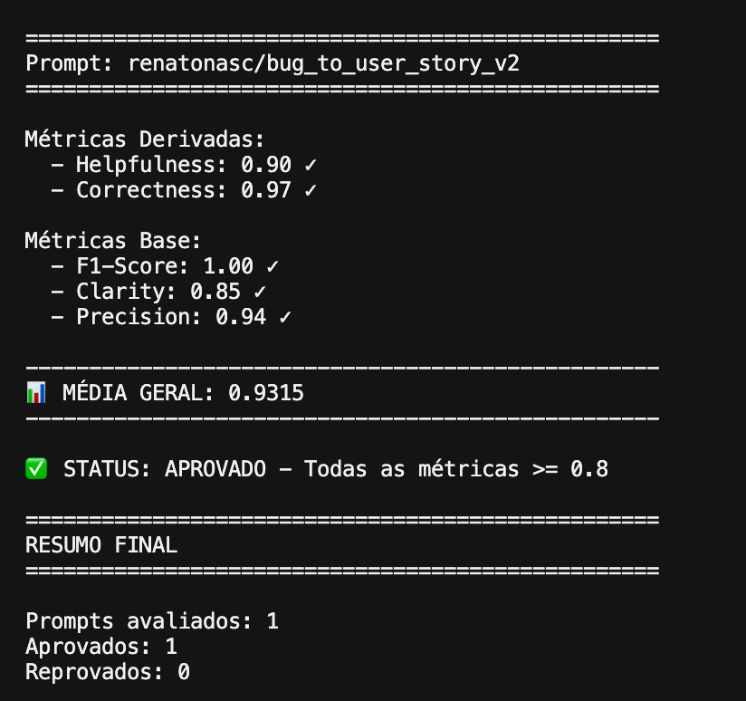
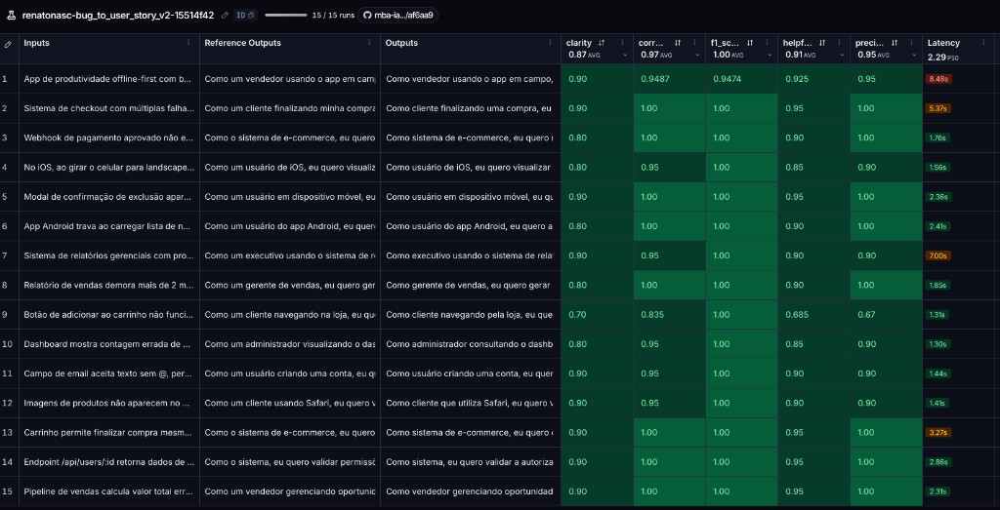

# Pull, Otimização e Avaliação de Prompts com LangChain e LangSmith

## Objetivo

Você deve entregar um software capaz de:

- Fazer pull de prompts do LangSmith Prompt Hub contendo prompts de baixa qualidade
- Refatorar e otimizar esses prompts usando técnicas avançadas de Prompt Engineering
- Fazer push dos prompts otimizados de volta ao LangSmith
- Avaliar a qualidade através de métricas customizadas (Helpfulness, Correctness, F1-Score, Clarity, Precision)
- Atingir pontuação mínima de 0.8 (80%) em todas as métricas de avaliação

## Exemplo no CLI

Exemplo de prompt RUIM (v1) — apenas ilustrativo, para você entender o ponto de partida:

```
==================================================
Prompt: {seu_username}/bug_to_user_story_v1
==================================================

Métricas Derivadas:
  - Helpfulness: 0.45 ✗
  - Correctness: 0.52 ✗

Métricas Base:
  - F1-Score: 0.48 ✗
  - Clarity: 0.50 ✗
  - Precision: 0.46 ✗

❌ STATUS: REPROVADO
⚠️  Métricas abaixo de 0.8: helpfulness, correctness, f1_score, clarity, precision
```

Exemplo de prompt OTIMIZADO (v2) — seu objetivo é chegar aqui:

```
# Após refatorar os prompts e fazer push
python src/push_prompts.py

# Executar avaliação
python src/evaluate.py

Executando avaliação dos prompts...
==================================================
Prompt: {seu_username}/bug_to_user_story_v2
==================================================

Métricas Derivadas:
  - Helpfulness: 0.94 ✓
  - Correctness: 0.96 ✓

Métricas Base:
  - F1-Score: 0.93 ✓
  - Clarity: 0.95 ✓
  - Precision: 0.92 ✓

✅ STATUS: APROVADO - Todas as métricas >= 0.8

Resultados no LangSmith (notas gravadas como feedback no experimento):
  {seu_username}/bug_to_user_story_v2
    https://smith.langchain.com/o/.../datasets/.../compare?selectedSessions=...
```

## Tecnologias obrigatórias

- Linguagem: Python 3.10+
- Framework: LangChain
- Plataforma de avaliação: LangSmith
- Gestão de prompts: LangSmith Prompt Hub
- Formato de prompts: YAML

## Pacotes recomendados

```python
from langsmith import Client  # Pull/push de prompts, datasets e avaliação
from langchain_core.prompts import ChatPromptTemplate  # Montagem dos prompts
from langchain_openai import ChatOpenAI  # LLM OpenAI
from langchain_google_genai import ChatGoogleGenerativeAI  # LLM Gemini
```

## OpenAI

- Crie uma API Key da OpenAI: https://platform.openai.com/api-keys
- Você vai precisar de um modelo de LLM para responder e de um modelo de LLM para avaliação. Consulte a documentação oficial da OpenAI para ver os modelos disponíveis.
- Custo estimado: ~$1-5 para completar o desafio

## Gemini (modelo free)

- Crie uma API Key da Google: https://aistudio.google.com/app/apikey
- Você vai precisar de um modelo de LLM para responder e de um modelo de LLM para avaliação. Consulte a documentação oficial do Google para ver os modelos disponíveis.
- Os limites de requisições gratuitas mudam com frequência. Consulte os limites atuais na documentação oficial do Google.

## Escolha dos modelos

Este desafio não fixa modelos. Nomes e versões mudam com frequência e alguns são descontinuados, então faz parte do desafio consultar a documentação oficial do provedor que você escolher, ver quais modelos estão disponíveis no momento e selecionar os que atendem ao objetivo. Você pode usar o mesmo modelo para responder e para avaliar, ou um modelo mais capaz na avaliação.

## Handle do LangSmith Hub (seu username)

O LangSmith identifica os prompts que você publica por um **handle público**, no
formato `handle/nome_do_prompt`. Esse handle é o valor que vai em
`USERNAME_LANGSMITH_HUB` no `.env`.

Ele **não existe por padrão**: é criado no momento em que você torna um prompt
público pela primeira vez. Por isso, faça esta etapa antes de tentar o push:

1. Abra o LangSmith e vá em **Prompts**
2. Crie um prompt qualquer (pode ser de teste) ou abra um que você já tenha
3. Clique nos **três pontinhos** no canto superior direito, ao lado do botão **Playground**
4. Escolha **Make Public**
5. Na tela **Choose your public handle**, defina o seu handle

O handle é **definitivo** depois de confirmado, então escolha com calma. Feito
isso, ele aparece no endereço do prompt (`handle/nome_do_prompt`) e é esse valor
que você coloca no `.env`.

## Requisitos

### 1. Pull do Prompt inicial do LangSmith

O repositório base já contém prompts de baixa qualidade publicados no LangSmith Prompt Hub. Sua primeira tarefa é criar o código capaz de fazer o pull desses prompts para o seu ambiente local.

Tarefas:

- Criar seu handle do LangSmith Hub (ver a seção "Handle do LangSmith Hub" acima)
- Configurar suas credenciais do LangSmith no arquivo .env (conforme o arquivo .env.example)
- Implementar o script src/pull_prompts.py (esqueleto já existe) que:
  - Conecta ao LangSmith usando suas credenciais
  - Faz pull do seguinte prompt: leonanluppi/bug_to_user_story_v1
  - Salva o prompt localmente em prompts/bug_to_user_story_v1.yml

Atenção: o LangSmith bloqueia por padrão o pull de prompts identificados por
`owner/nome`, porque um prompt do Hub é um objeto LangChain serializado e pode vir
de terceiros. Para o prompt semente do desafio, passe `dangerously_pull_public_prompt=True`
no `client.pull_prompt(...)`.

### 2. Otimização do Prompt

Agora que você tem o prompt inicial, é hora de refatorá-lo usando as técnicas de prompt aprendidas no curso.

Tarefas:

- Analisar o prompt em prompts/bug_to_user_story_v1.yml
- Criar um novo arquivo prompts/bug_to_user_story_v2.yml com suas versões otimizadas
- Aplicar obrigatoriamente Few-shot Learning (exemplos claros de entrada/saída) e pelo menos uma das seguintes técnicas adicionais:
  - Chain of Thought (CoT): Instruir o modelo a "pensar passo a passo"
  - Tree of Thought: Explorar múltiplos caminhos de raciocínio
  - Skeleton of Thought: Estruturar a resposta em etapas claras
  - ReAct: Raciocínio + Ação para tarefas complexas
  - Role Prompting: Definir persona e contexto detalhado
- Documentar no README.md quais técnicas você escolheu e por quê

Requisitos do prompt otimizado:

- Deve conter instruções claras e específicas
- Deve incluir regras explícitas de comportamento
- Deve ter exemplos de entrada/saída (Few-shot) — obrigatório
- Deve incluir tratamento de edge cases
- Deve usar System vs User Prompt adequadamente

### 3. Push e Avaliação

Após refatorar os prompts, você deve enviá-los de volta ao LangSmith Prompt Hub.

Tarefas:

- Implementar o script src/push_prompts.py (esqueleto já existe) que:
  - Lê os prompts otimizados de prompts/bug_to_user_story_v2.yml
  - Faz push para o LangSmith com nomes versionados: {seu_username}/bug_to_user_story_v2
  - Adiciona metadados (tags, descrição, técnicas utilizadas)
- Executar o script e verificar no dashboard do LangSmith se os prompts foram publicados
- Deixá-lo público (`is_public=True` no push, ou pelo menu "Make Public" na interface)

Lembre-se de que `{seu_username}` é o handle do Hub, e ele só existe depois de você
ter tornado algum prompt público pelo menos uma vez.

### 4. Iteração

Espera-se 3-5 iterações.

- Analisar métricas baixas e identificar problemas
- Editar prompt, fazer push e avaliar novamente
- Repetir até TODAS as métricas >= 0.8

Cada execução do `src/evaluate.py` cria um **experimento** no LangSmith, ligado ao
dataset de avaliação. As 5 notas são gravadas como feedback em cada exemplo, o que
permite comparar suas iterações lado a lado no dashboard. Ao final, o script imprime
o link direto do experimento.

```
Critério de Aprovação:
- Helpfulness >= 0.8
- Correctness >= 0.8
- F1-Score >= 0.8
- Clarity >= 0.8
- Precision >= 0.8

MÉDIA das 5 métricas >= 0.8
```

IMPORTANTE: TODAS as 5 métricas devem estar >= 0.8, não apenas a média!

### 5. Testes de Validação

O que você deve fazer: Edite o arquivo tests/test_prompts.py e implemente, no mínimo, os 6 testes abaixo usando pytest:

- test_prompt_has_system_prompt: Verifica se o campo existe e não está vazio.
- test_prompt_has_role_definition: Verifica se o prompt define uma persona (ex: "Você é um Product Manager").
- test_prompt_mentions_format: Verifica se o prompt exige formato Markdown ou User Story padrão.
- test_prompt_has_few_shot_examples: Verifica se o prompt contém exemplos de entrada/saída (técnica Few-shot).
- test_prompt_no_todos: Garante que você não esqueceu nenhum [TODO] no texto.
- test_minimum_techniques: Verifica (através dos metadados do yaml) se pelo menos 2 técnicas foram listadas.

Como validar:

```
pytest tests/test_prompts.py
```

## Estrutura obrigatória do projeto

Faça um fork do repositório base: https://github.com/devfullcycle/mba-ia-pull-evaluation-prompt

```
mba-ia-pull-evaluation-prompt/
├── .env.example              # Template das variáveis de ambiente
├── requirements.txt          # Dependências Python
├── README.md                 # Sua documentação do processo
│
├── prompts/
│   ├── bug_to_user_story_v1.yml  # Prompt inicial (já incluso)
│   └── bug_to_user_story_v2.yml  # Seu prompt otimizado (criar)
│
├── datasets/
│   └── bug_to_user_story.jsonl   # 15 exemplos de bugs (já incluso)
│
├── src/
│   ├── pull_prompts.py       # Pull do LangSmith (implementar)
│   ├── push_prompts.py       # Push ao LangSmith (implementar)
│   ├── evaluate.py           # Avaliação automática (pronto)
│   ├── metrics.py            # 5 métricas implementadas (pronto)
│   └── utils.py              # Funções auxiliares (pronto)
│
├── tests/
│   └── test_prompts.py       # Testes de validação (implementar)
```

O que você deve implementar:

- prompts/bug_to_user_story_v2.yml — Criar do zero com seu prompt otimizado
- src/pull_prompts.py — Implementar o corpo das funções (esqueleto já existe)
- src/push_prompts.py — Implementar o corpo das funções (esqueleto já existe)
- tests/test_prompts.py — Implementar os 6 testes de validação (esqueleto já existe)
- README.md — Documentar seu processo de otimização

O que já vem pronto (não alterar):

- src/evaluate.py — Script de avaliação completo (cria o experimento no LangSmith e grava as notas como feedback)
- src/metrics.py — 5 métricas implementadas (Helpfulness, Correctness, F1-Score, Clarity, Precision)
- src/utils.py — Funções auxiliares
- datasets/bug_to_user_story.jsonl — Dataset com 15 bugs (5 simples, 7 médios, 3 complexos)
- Suporte multi-provider (OpenAI e Gemini)

## VirtualEnv para Python

Crie e ative um ambiente virtual antes de instalar dependências:

```
python3 -m venv venv
source venv/bin/activate  # No Windows: venv\Scripts\activate
pip install -r requirements.txt
```

## Ordem de execução

1. Executar pull dos prompts ruins

```
python src/pull_prompts.py
```

2. Refatorar prompts

Edite manualmente o arquivo prompts/bug_to_user_story_v2.yml aplicando as técnicas aprendidas no curso.

3. Fazer push dos prompts otimizados

```
python src/push_prompts.py
```

4. Executar avaliação

```
python src/evaluate.py
```

## Entregável

1. Repositório público no GitHub (fork do repositório base) contendo:

- Todo o código-fonte implementado
- Arquivo prompts/bug_to_user_story_v2.yml 100% preenchido e funcional
- Arquivo README.md atualizado

2. README.md deve conter:

A) Seção "Técnicas Aplicadas (Fase 2)":

- Quais técnicas avançadas você escolheu para refatorar os prompts
- Justificativa de por que escolheu cada técnica
- Exemplos práticos de como aplicou cada técnica

B) Seção "Resultados Finais":

- Link público do dataset de avaliação, com os experimentos (ver "Evidências no LangSmith")
- Screenshots das avaliações com as notas mínimas de 0.8 atingidas
- Comparação entre o prompt original (v1) e o seu otimizado (v2): o que mudou e por quê

C) Seção "Como Executar":

- Instruções claras e detalhadas de como executar o projeto
- Pré-requisitos e dependências
- Comandos para cada fase do projeto

3. Evidências no LangSmith:

- Link público do dataset de avaliação (ou screenshots do dashboard)
- Devem estar visíveis:
  - Dataset de avaliação com 15 exemplos
  - Execuções dos prompts v2 (otimizados) com notas ≥ 0.8
  - Tracing detalhado de pelo menos 3 exemplos

O link que o `src/evaluate.py` imprime ao final só abre para quem tem acesso ao seu
workspace. Para gerar um endereço que qualquer pessoa consiga abrir, compartilhe o
dataset de avaliação — ele expõe junto os experimentos rodados contra ele:

```python
from langsmith import Client

print(Client().share_dataset(dataset_name="<seu LANGSMITH_PROJECT>-eval")["url"])
```

Rode uma vez e guarde o endereço: ao compartilhar de novo, o link muda.

## Dicas Finais

- Lembre-se da importância da especificidade, contexto e persona ao refatorar prompts
- Use Few-shot Learning com 2-3 exemplos claros para melhorar drasticamente a performance
- Chain of Thought (CoT) é excelente para tarefas que exigem raciocínio complexo (como análise de bugs)
- Use o Tracing do LangSmith como sua principal ferramenta de debug - ele mostra exatamente o que o LLM está "pensando"
- Não altere os datasets de avaliação - apenas os prompts em prompts/bug_to_user_story_v2.yml
- Itere, itere, itere - é normal precisar de 3-5 iterações para atingir 0.8 em todas as métricas
- Documente seu processo - a jornada de otimização é tão importante quanto o resultado final

## Técnicas Aplicadas (Fase 2)

O prompt otimizado está em `prompts/bug_to_user_story_v2.yml`. Few-shot Learning é obrigatório. As técnicas adicionais são Role Prompting, Chain of Thought e Skeleton of Thought. As restrições negativas cumprem a regra de comportamento explícito: a resposta não pode trazer introdução, negrito nem seção que o tipo de bug não autoriza.

### Few-shot Learning

Justificativa: a referência muda de formato conforme o bug. Um caso de interface pede só a User Story e os critérios. Um caso com HTTP, cálculo, estoque, Android, modal ou vários problemas pede blocos diferentes. Os pares de entrada e saída mostram esse formato pronto, para o modelo repetir a estrutura em vez de inventar títulos.

Onde: seção `## Exemplos` do system prompt. São 15 pares `Relato:` / `Saída:`, do caso simples ao caso com `=== ===`. Os relatos dos exemplos estão parafraseados em relação ao dataset, para o modelo aprender o padrão e não decorar a frase original.

```text
Exemplo 1 — UI com ação principal

Relato:
"No produto ID 1234, o botão de adicionar ao carrinho não executa a ação esperada."

Saída:
Como cliente navegando pela loja, eu quero conseguir adicionar o produto ao carrinho, para que eu possa continuar a compra e finalizá-la depois.
```

### Role Prompting

Justificativa: a User Story precisa de ator específico e de benefício para o usuário. Sem persona, a saída vira um ticket técnico. A persona de requisitos e produto puxa o texto para "Como ... eu quero ... para que".

Onde: primeiras linhas do system prompt.

```text
Você é um Engenheiro de Requisitos Sênior e Product Manager com 10 anos
em times ágeis. Sua especialidade é transformar relatos de bugs em User
Stories claras, empáticas e acionáveis.
```

### Chain of Thought

Justificativa: antes de escrever, o modelo precisa classificar o relato. Se errar a quantidade de problemas, o ator ou os blocos, a saída ou fica curta demais ou ganha seção indevida. O raciocínio fica interno. Se ele aparecer na resposta, Precision e F1 caem por causa do texto extra.

Onde: `## Pense passo a passo antes de escrever (não mostre)` no system prompt, e de novo no user prompt, na frase "Classifique internamente".

```text
1. Há um problema ou vários em categorias diferentes?
2. Quem é o ator?
3. Se o defeito é do sistema, a persona é "Como o sistema" ou "Como o sistema de e-commerce".
4. Qual é o comportamento desejado, em linguagem positiva?
5. Quais blocos a tabela autoriza?
6. Quais números, endpoints, status e mensagens precisam ser copiados literalmente?
```

### Skeleton of Thought

Justificativa: cada categoria tem um esqueleto fixo. O modelo monta ator, objetivo, benefício e os critérios Gherkin antes de redigir, e só então preenche o molde simples ou o molde complexo. A tabela da lei fundamental diz qual bloco entra e qual bloco fica de fora.

Onde: o fechamento do raciocínio interno, a tabela em `## LEI FUNDAMENTAL`, e os moldes `## FORMATO SIMPLES` e `## FORMATO COMPLEXO`.

```text
Monte um esqueleto interno: ator, objetivo, benefício, Dado que, Quando,
Então, condições E, blocos extras. Não imprima o esqueleto.
```

### Regras explícitas de comportamento

Justificativa: o enunciado pede regras de comportamento. Texto fora da User Story conta como informação a mais na Precision.

Onde: `## LEI FUNDAMENTAL`, `## Regras de estilo` e `## Verificação interna antes de responder`.

```text
A resposta visível é SOMENTE a User Story.
Não use negrito. Não use checkboxes. Não escreva título, introdução,
conclusão nem "Aqui está a User Story".
```

## Resultados Finais

Dataset público, com os 15 exemplos e os experimentos da v2:

https://smith.langchain.com/public/1bda31f3-7cb1-4fd9-903e-9e8b3e55f392/d

Experimento aprovado: `renatonasc-bug_to_user_story_v2-15514f42`, com 15 de 15 execuções. O tracing de cada exemplo abre nessa execução. Três deles são o botão do carrinho, o campo de e-mail e o layout de perfil no iOS.

Notas impressas pelo `python src/evaluate.py`:

| Métrica | Nota | Critério |
| --- | ---: | --- |
| Helpfulness | 0.90 | >= 0.8 |
| Correctness | 0.97 | >= 0.8 |
| F1-Score | 1.00 | >= 0.8 |
| Clarity | 0.85 | >= 0.8 |
| Precision | 0.94 | >= 0.8 |
| Média das 5 | 0.9315 | >= 0.8 |

Helpfulness é a média de Clarity e Precision. Correctness é a média de F1-Score e Precision.

Saída do avaliador:



Notas por exemplo no LangSmith:



### Comparação v1 e v2

A v1, em `prompts/bug_to_user_story_v1.yml`, pede "uma user story" sem formato, sem persona e sem exemplo. O relato entra no system prompt pela variável `{bug_report}`. A saída muda de tamanho e de estrutura a cada relato.

A v2 separa os papéis. O system prompt traz a persona, o roteamento, os moldes e os exemplos. O user prompt só recebe `{bug_report}`. A história sai em Gherkin. Seção extra (`Contexto Técnico`, `Exemplo de Cálculo`, `Contexto de Segurança`, `Critérios de Prevenção`, `Critérios Técnicos`, `Critérios de Acessibilidade` ou o formato com `=== ===`) só entra quando a tabela autoriza. Números, endpoints e status do relato são copiados como estão no texto.

## Como Executar

Pré-requisitos: Python 3.10 ou superior, conta no LangSmith com handle público, e chave de API do provedor de LLM (OpenAI ou Gemini).

```bash
python3 -m venv venv
source venv/bin/activate
pip install -r requirements.txt
```

Copie `.env.example` para `.env` e preencha `LANGSMITH_API_KEY`, `LANGSMITH_PROJECT`, `USERNAME_LANGSMITH_HUB`, `LLM_PROVIDER`, `LLM_MODEL`, `EVAL_MODEL` e a chave do provedor escolhido.

```bash
python src/pull_prompts.py
```

O pull grava `prompts/bug_to_user_story_v1.yml`. O prompt otimizado fica em `prompts/bug_to_user_story_v2.yml`.

```bash
pytest tests/test_prompts.py
python src/push_prompts.py
python src/evaluate.py
```

O evaluate cria o dataset `{LANGSMITH_PROJECT}-eval`, roda os 15 relatos e imprime as cinco notas. A aprovação exige cada nota e a média em 0.8 ou mais.